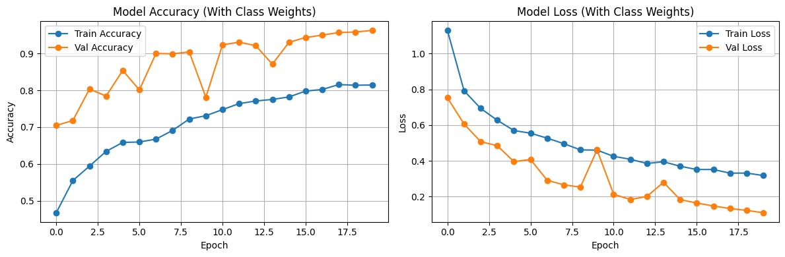

# Distracted Driver Detection

---

## 1) Introduction
Distracted driving is a leading contributor to road accidents worldwide. With increasing availability of in-cabin cameras and affordable computation, computer vision methods can be applied to automatically monitor driver behaviour and issue alerts. This project implements a **deep learning-based framework** to classify driver behaviour into three categories : `safe driving`, `using phone`, and `drinking` using **Convolutional Neural Networks (CNNs)**.  
A web-based application built with Flask demonstrates the deployment of this system, enabling users to upload videos, classify frames in real-time, and view structured results.

---

## 2) Motivation
The motivation for this project is grounded in the urgent societal need to improve road safety through technology. Manual monitoring is not feasible at scale, and traditional rule-based systems cannot handle the variability of real-world conditions. Our goals include: 

- Contributing to **road safety** by detecting distracted driving behaviours that are among the leading causes of accidents worldwide.  
- Using technology to create **positive change** by supporting safer driving practices and potentially reducing preventable collisions.  
- Demonstrating how deep learning can be applied to a **real-world social problem**, moving beyond theory into noticeable impact.  
- Building an end-to-end system that progresses from **raw data -> trained models -> video analysis -> web deployment**, thereby replicating a full data science lifecycle.  


---

## 3) Abstract
This project applies **deep convolutional neural networks** to the *State Farm Distracted Driver Detection* dataset (Kaggle). We restricted the dataset to three classes of driver activity. Preprocessing involved resizing to 224×224 pixels, normalisation, and targeted augmentation. Class imbalance was addressed with augmentation and class weighting.  

We built two models:  
1. A **baseline CNN** with two convolutional blocks.  
2. A **custom CNN** with four convolutional layers, Batch Normalisation, Dropout and L2 regularisation.  

The best model achieved **~98% test accuracy** with balanced precision, recall, and F1-score across classes. A **video-to-image pipeline** was developed to apply these models frame-by-frame, aggregating results into offence intervals. Finally, a **Flask web application** was implemented with user uploads, employee authentication, driver ID logging, and dashboard features.  

---

## 4) Dataset
- **Source:** [State Farm Distracted Driver Detection : Drive Link](https://drive.google.com/file/d/1dGWHooahe5qtzGRhn20zAL-qRLR0FXUw/view?usp=sharing)
- **Dataset Size:** 4.6GB
- *Note : Dataset not uploaded on Github due to limitations of size. Please access it using the Drive link above.* 
- **Classes Used:**  
  - *safe_driving* (c0)  
  - *using_phone* (merged c1–c4)  
  - *drinking* (c6)  
- **Filtered Image Count:** ~14,000  
- **Split Ratio:** Train 60%, Validation 20%, Test 20%  

<p align="left">
  
  
  
</p>
<p align="center">Figure 1. Examples of the different classes in the dataset subset</p> 


**Class distribution (for weighting):**

| Class         | Count |
|---------------|------:|
| using_phone   |  9256 |
| safe_driving  |  2489 |
| drinking      |  2325 |

<p align="center">
  
</p>
<p align="center">Figure 2. Showcasing Class Imbalance in the Dataset Subset</p> 

The dataset was stored in structured directories (`train`, `validation`, `test`) with CSV metadata linking image IDs to class labels.

---

## 5) Objectives
The primary objectives were:  
1. To preprocess, clean, and structure the dataset for supervised learning.  
2. To design and train a **baseline CNN** for driver activity recognition.  
3. To design and train a **custom CNN** with architectural enhancements for improved generalisation.  
4. To evaluate models using metrics beyond accuracy (precision, recall, F1).  
5. To build a **video-to-image inference pipeline**.  
6. To integrate the trained models into a **Flask application** with a usable front-end.  

---

## 6) Folder Structure

```
distracted_driver_dataset/
│
├── notebooks/
│ ├── 01_data_cleaning.ipynb
│ ├── 02_baseline_cnn.ipynb
│ ├── 03_custom_cnn.ipynb
│ └── 04_video_pipeline.ipynb
│
├── static/
│ ├── uploads/
│ ├── combined_snapshots/
│ └── style.css
│
├── templates/
│ ├── index.html
│ ├── login.html
│ ├── dashboard.html
│ └── result.html
│
├── split_data/
│ ├── training/ ├── validation/ ├── testing/
│ ├── training_data.csv
│ ├── validation_data.csv
│ └── testing_data.csv
│
├── raw_data/ # Original dataset
├── filtered_dataset/ # Filtered to 3 classes
├── full_dataset/ # Flattened images
│
├── baseline_model.keras
├── best_custom_cnn_model.keras
├── custom_cnn_model.keras
├── image_data.csv
├── app.py
├── requirements.txt
├── readme.md
└── readme_assets/ # README images
```

---

## 7) Dataset Cleaning and Preprocessing
- **Cleaning:** Non-relevant classes removed; metadata extracted.  
- **Resizing:** All images resized to 224×224 pixels.  
- **Augmentation (train only):** random zoom, flips, brightness changes, small rotations.  
- **Data Handling:** Implemented using `flow_from_dataframe` with Pandas CSVs.  
- **Class Imbalance Mitigation:** Class weights calculated as `total_samples / (num_classes * samples_per_class)` and passed to `model.fit`.  

<p align="center">
  
</p>
<p align="center">Figure 3. Dataset Augmentation Batch Sample</p> 

---

## 8) Baseline Model and Results

**Architecture (Keras):**
- Input: 224 × 224 × 3 RGB image
- Conv2D (32 filters, 3×3, ReLU) -> MaxPooling (2×2)
- Conv2D (64 filters, 3×3, ReLU) -> MaxPooling (2×2)
- Flatten
- Dense (64 units, ReLU)
- Dropout (0.5)
- Dense (3 units, Softmax)

<p align="center">
  
  
</p>
<p align="center">Figure 4. Architecture of the Baseline CNN </p>

**Training Setup:**
- Optimiser: Adam  
- Loss Function: categorical cross-entropy  
- Metrics: Accuracy  

### Evaluation  

The baseline CNN achieved an overall **test accuracy of ~96%**, showing that even a shallow architecture can capture important distinctions between distracted and safe driving behaviours.  

The **confusion matrix** (Figure 4) demonstrates strong performance across all three classes, with the majority of samples correctly identified. Occasional misclassifications were observed between *safe_driving* and *using_phone*, as well as between *using_phone* and *drinking*.  

The **training and validation curves** (Figure 4) indicate consistent improvement in accuracy and a steady decrease in loss across epochs. While validation performance was strong, the relatively shallow architecture limited the ability of the model to capture more complex discriminative patterns, especially in borderline cases of distraction. 

<p align="center">
  
  
</p>
<p align="center">Figure 5. Predictive Performance Results of the Baseline CNN </p>  

**Key Takeaways from the model:**  
- Strengths: High accuracy, stable training, effective handling of core classes.  
- Limitations: Limited representational power due to shallow architecture, occasional confusion between visually similar behaviours.  

These observations motivated the design of a **custom CNN** with additional depth and regularisation strategies to improve feature extraction and generalisation.


---

## 9) Custom CNN Model and Results

**Architecture (Keras):**
- Input: 224 × 224 × 3 RGB image
- Block 1: Conv2D (32 filters, 3×3, ReLU, same padding) -> Batch Normalisation -> MaxPooling (2×2)
- Block 2: Conv2D (64 filters, 3×3, ReLU, same padding) -> Batch Normalisation -> MaxPooling (2×2)
- Block 3: Conv2D (96 filters, 3×3, ReLU, same padding) -> Batch Normalisation -> MaxPooling (2×2)
- Block 4: Conv2D (128 filters, 3×3, ReLU, same padding) -> Batch Normalisation -> MaxPooling (2×2)
- Global Average Pooling
- Dense (128 units, ReLU, L2 regularisation = 0.002) -> Dropout (0.4)
- Dense (3 units, Softmax)

**Training Setup:**
- Optimiser: Adam (learning rate = 0.0005)  
- Loss Function: categorical cross-entropy  
- Callbacks: EarlyStopping, ModelCheckpoint, ReduceLROnPlateau  
- Metrics: Accuracy  

<p align="center">
  
</p>

<p align="center">
  
</p>
<p align="center">Figure 6. Detailed architecture of the Custom CNN</p>  

---

### Evaluation  

The **accuracy curve** (Figure 6) shows rapid convergence, with training accuracy exceeding 99% and validation accuracy stabilising near 99% as well. Early fluctuations in validation accuracy were addressed through learning rate scheduling and early stopping, preventing overfitting.  

<p align="center">
  
</p>
<p align="center">Figure 7. Accuracy per epoch for Custom CNN</p>  

The **loss curves** (Figure 7) illustrate the effectiveness of the regularisation strategies. While the validation loss exhibited initial instability, it quickly converged and closely tracked training loss in later epochs, suggesting strong generalisation.  

<p align="center">
  
</p>
<p align="center">Figure 8. Training and validation loss per epoch for Custom CNN</p>  

---

### Confusion Matrix and Classification Report  

The **confusion matrix** (Figure 8) highlights the robustness of the custom model. Unlike the baseline, misclassifications were almost entirely eliminated, with only a handful of errors across all classes.  

<p align="center">
  
</p>
<p align="center">Figure 9. Confusion Matrix of the Custom CNN</p>  

The **classification report** (Figure 9) quantifies performance:  
- Overall accuracy: **99.3%**  
- Macro average F1: **0.992**  
- Weighted average F1: **0.993**  
- Precision and recall values close to 1.0 for all classes  

<p align="center">
  
</p>
<p align="center">Figure 10. Precision, recall, and F1 scores for Custom CNN</p>  

---

### Qualitative Results  

The custom CNN also demonstrated high confidence in predictions for real test samples, as shown in Figure 10.  

<p align="center">
  
</p>
<p align="center">Figure 11. Correctly classified examples from the test set</p>  

To further validate predictions, we compared the **true vs. predicted class distributions** (Figure 11). The alignment between the two distributions confirms the model’s reliability across all categories.  

<p align="center">
  
</p>
<p align="center">Figure 12. True vs predicted distributions for the Custom CNN</p>  

---

**Key Takeaways from the model:**  
- Strengths: Significantly improved accuracy and F1-score, highly stable training with effective use of Batch Normalisation and L2 regularisation, strong consistency across all classes.  
- Limitations: Increased computational cost compared to baseline due to deeper architecture.  

The custom CNN successfully addressed the representational limitations of the baseline model, providing a more generalisable and reliable framework for distracted driver detection.


---

## 10) Video Pipeline  

To extend the image-based CNN to real-world driving scenarios, we designed a **frame-by-frame video pipeline**. This system integrates the trained CNN to analyse driving behaviour from recorded footage:  

1. **Frame Extraction and Classification:** Video frames are sampled at fixed intervals (FPS) and classified individually using the trained CNN model.  
2. **Offence Detection:** Consistent predictions (≥10 frames in sequence) are aggregated to detect distracted behaviour events, including *using phone* and *drinking*.  
3. **Result Generation:** For each detected offence, the pipeline saves annotated snapshots and reports the offence type, start and end time, and total duration.  

### Example Results  

<p align="center">
  
</p>  
<p align="center">Figure 13. Detected offence: <i>using_phone</i> from 7.0s to 10.4s (duration: 3.4s)</p>  

<p align="center">
  
</p>  
<p align="center">Figure 14. Detected offence: <i>using_phone</i> from 141.0s to 146.1s (duration: 5.2s)</p>  

**Outcome:** The video pipeline enables the transition from static image classification to dynamic event detection, making the system more applicable to real-world monitoring scenarios.
 

---

## 11) Webpage and Functionalities  

The **Flask web application (`app.py`)** demonstrates how the trained models can be deployed in a real-world interface. It provides functionalities for both **passengers** (uploading videos) and **employees** (reviewing logs and predictions).  

### Features  
- **Upload Form:** A simple interface where passengers enter their ID and upload a video.  
- **Authentication:** A login system for employees, ensuring that only authorised users can view submissions and results.  
- **Dashboard:** An administrative view of all uploaded videos and associated driver IDs, with logs maintained in `submissions.xlsx`.  
- **Analysis Route:** When a video is submitted, the pipeline is triggered to classify frames, annotate offences, and display results in `result.html`. 
- **Flagged Drivers** – After reviewing the results, we can flag a driver, and the system records this in an elextronic report (`flagged_drivers.xlsx`) with the date and time of the flag.


### Key Routes  
| Route             | Description                                        |
|-------------------|----------------------------------------------------|
| `/`               | Home page with upload form (Driver ID + Video)     |
| `/submit`         | Handles file upload and stores driver submission   |
| `/login`          | Employee login for secure access                   |
| `/dashboard`      | Dashboard listing all uploads and their metadata   |
| `/analyze/<vid>`  | Executes the video pipeline and renders results    |
|  `/flagged`       | Shows a list of all the flagged drivers with time stamp|

The outputs of the application are visual and interactive. Passengers begin by uploading a video and providing the Driver ID, as shown in the screenshot below.  

<p align="center">
  
</p>
<p align="center">Figure 15. Passenger upload form where a unique Driver ID and corresponding video are submitted for analysis</p>  

Once the upload is complete, the system confirms the submission. Then an authorised employee can login and trigger a video analysis from the dashboard.At this stage, employees see that the video is being analysed in real time.  

<p align="center">
  
</p>
<p align="center">Figure 16. Video analysis is in progress supported by backend pipeline being invoked to extract frames and classify driver behaviour</p>  

After processing, the results are logged into the system. Employees can view a list of flagged drivers along with their corresponding video submissions, enabling easy tracking and record-keeping. 

Employees can review the analysis results for each driver. The interface displays detected offences with prediction confidence, timestamps, and annotated snapshots from the video. Employees are also given the option to confirm or dismiss the offence, introducing a human-in-the-loop verification step.  

<p align="center">
  
</p>
<p align="center">Figure 17. Results page showing predicted offences with confidence levels, annotated frames, and a manual verification option for employees</p> 


Finally, the employee can see the list of flagged drivers on the dashboard along with the Driver ID and the timestamp of when they were flagged. 
<p align="center">
  
</p>
<p align="center">Figure 18. Dashboard showing flagged drivers and their associated video files with timestamps</p>  

  

This end-to-end workflow transforms the CNN models into an operational safety tool, making predictions not only interpretable but also actionable in real-world driver monitoring.
  

## 12) Licenses  

The project is released under the **MIT License**, which permits reuse, modification, and distribution with attribution.  
- **Code:** Freely available under MIT License for academic and research purposes.  
- **Dataset:** The images used are derived from the *State Farm Distracted Driver Detection* dataset on Kaggle and are bound by Kaggle’s original licensing and usage terms.
- **Models and Outputs:** Trained weights and model artefacts can be shared under the same conditions, provided the dataset licensing terms are respected.  

---

## 13) Further Scope and Improvements  

While the current system achieves high accuracy and reliable deployment, there are several directions for extending this work:  

1. **Real-time monitoring:** Incorporating live webcam or in-vehicle camera streams for instantaneous offence detection.  
2. **Extended classes:** Expanding the model to detect all 10 driver behaviours available in the original dataset (e.g., texting, reaching behind, adjusting the radio).  
3. **Model compression:** Exploring lightweight architectures such as MobileNet or pruning strategies to enable deployment on embedded devices.  
4. **Direct video annotation:** Integrating frame predictions directly into the video output (.mp4 or .avi), rather than static snapshots, for seamless review.  
5. **Cloud deployment:** Hosting the full system on platforms such as AWS, GCP, or Azure to enable large-scale monitoring and multi-user access.  
6. **Human-in-the-loop feedback:** Incorporating employee feedback from the dashboard to refine predictions and continuously improve the model.  

These extensions would strengthen the applicability of the system in **fleet management, ride-sharing services, and road safety enforcement**, aligning the project with broader research and industrial use cases.  

---

## 14) Contact Us  

For further collaboration, feedback, or inquiries, please reach out to the authors below:  

**Nishanth Chennagiri Keerthi**  
- 📧 Email: `nishanthkeerthi@gmail.com` | `nishanth.keerthi@ucdconnect.ie`  
- 🔗 LinkedIn: [linkedin.com/in/nishanth-keerthi](https://www.linkedin.com/in/nishanth-keerthi/)  
- 🔗 GitHub: [nishanth-keerthi](https://github.com/nishanth-keerthi)  
- 🌐 Portfolio: [Nishanth’s Data Portfolio](https://ordinary-molybdenum-d39.notion.site/Nishanth-s-Data-Portfolio-227c3247852b80c092d1f28d2f08e48d)  
- 🌳 Linktree: [linktr.ee/nishanth_chennagiri_keerthi](https://linktr.ee/nishanth_chennagiri_keerthi)  

**Ashish Mohamed Usman**  
- 📧 Email: `ashishusmanmdk@gmail.com` | `ashish.mohamedusman@ucdconnect.ie`  
- 🔗 LinkedIn: [linkedin.com/in/ashish-mohamed-usman-5a0a851a5](http://www.linkedin.com/in/ashish-mohamed-usman-5a0a851a5)  
- 🔗 GitHub: [AshishAsh1999](https://github.com/AshishAsh1999)  
- 🌳 Linktree: [linktr.ee/ashish_mohamed_usman](https://linktr.ee/ashish_mohamed_usman)  
  


---

## 15) References  

[1] J. Lei, Z. Ni, Z. Peng, H. Hu, J. Hong, X. Fang, C. Yi, C. Ren, and M. A. Wasaye, “An intelligent network framework for driver distraction monitoring based on RES-SE-CNN,” *Scientific Reports*, vol. 15, p. 91293, 2025. doi: https://doi.org/10.1038/s41598-025-91293-5  

[2] S. Taamneh, P. Tsiamyrtzis, M. Dcosta, P. Buddharaju, et al., “A multimodal dataset for various forms of distracted driving,” *Scientific Data*, vol. 4, p. 170110, 2017. doi: https://doi.org/10.1038/sdata.2017.110  

[3] D. Mayhew, R. Robertson, S. Brown, and W. Vanlaar, *Driver Distraction and Hands-Free Texting While Driving*. Traffic Injury Research Foundation (TIRF), 2013. [Online]. Available: https://tirf.ca/wp-content/uploads/2017/01/Driver_Distraction_and_Hands-Free_Texting_While_Driving_3.pdf  

[4] *State Farm Distracted Driver Detection*, Kaggle Competition Dataset. [Online]. Available: https://www.kaggle.com/competitions/state-farm-distracted-driver-detection  

[5] TensorFlow/Keras Documentation. [Online]. Available: https://www.tensorflow.org/api_docs/python/tf/keras  

[6] OpenCV Documentation. [Online]. Available: https://docs.opencv.org/4.x/  

[7] Flask Documentation. [Online]. Available: https://flask.palletsprojects.com/  

---
