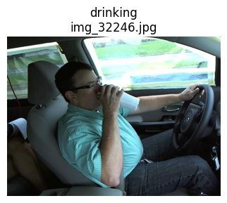

# Distracted Driver Detection Using Convolutional Neural Networks (CNNs) and Flask Web Application

---

## 1) Introduction
Distracted driving is a leading contributor to road accidents worldwide. With increasing availability of in-cabin cameras and affordable computation, computer vision methods can be applied to automatically monitor driver behaviour and issue alerts. This project implements a **deep learning-based framework** to classify driver behaviour into three categories — `safe driving`, `using phone`, and `drinking` — using **Convolutional Neural Networks (CNNs)**.  
A web-based application built with Flask demonstrates the deployment of this system, enabling users to upload videos, classify frames in real-time, and view structured results.

---

## 2) Motivation
The motivation for this project is grounded in the urgent societal need to improve road safety through technology. Manual monitoring is not feasible at scale, and traditional rule-based systems cannot handle the variability of real-world conditions. Our goals include:  
- Designing a machine learning pipeline that addresses class imbalance, a common issue in applied AI.  
- Demonstrating the difference between baseline and custom CNN architectures for a real-world safety application.  
- Building an end-to-end system that progresses from **raw data → trained models → video analysis → web deployment**, thereby replicating a full data science lifecycle.  

---

## 3) Abstract
This project applies **deep convolutional neural networks** to the *State Farm Distracted Driver Detection* dataset (Kaggle). We restricted the dataset to three classes of driver activity. Preprocessing involved resizing to 224×224 pixels, normalisation, and targeted augmentation. Class imbalance was addressed with augmentation and class weighting.  

We built two models:  
1. A **baseline CNN** with two convolutional blocks.  
2. A **custom CNN** with four convolutional layers, Batch Normalisation, and L2 regularisation.  

The best model achieved **~98% test accuracy** with balanced precision, recall, and F1-score across classes. A **video-to-image pipeline** was developed to apply these models frame-by-frame, aggregating results into offence intervals. Finally, a **Flask web application** was implemented with user uploads, employee authentication, driver ID logging, and dashboard features.  

---

## 4) Dataset
- **Source:** [State Farm Distracted Driver Detection : Drive Link](https://drive.google.com/file/d/1dGWHooahe5qtzGRhn20zAL-qRLR0FXUw/view?usp=sharing)
- **Dataset Size:**4.6GB
- *Note : Dataset not uploaded on Github due to limitations of size. Please access it using the Drive link above. * 
- **Classes Used:**  
  - *safe_driving* (c0)  
  - *using_phone* (merged c1–c4)  
  - *drinking* (c6)  
- **Filtered Image Count:** ~14,000  
- **Split Ratio:** Train 60%, Validation 20%, Test 20%  

<p align="center">
  
  
  
</p>


**Class distribution (for weighting):**

| Class         | Count |
|---------------|------:|
| using_phone   |  9256 |
| safe_driving  |  2489 |
| drinking      |  2325 |


The dataset was stored in structured directories (`train`, `validation`, `test`) with CSV metadata linking image IDs to class labels.

---

## 5) Objectives
The primary objectives were:  
1. To preprocess, clean, and structure the dataset for supervised learning.  
2. To design and train a **baseline CNN** for driver activity recognition.  
3. To design and train a **custom CNN** with architectural enhancements for improved generalisation.  
4. To evaluate models using metrics beyond accuracy (precision, recall, F1).  
5. To build a **video-to-image inference pipeline**.  
6. To integrate the trained models into a **Flask application** with a usable front-end.  

---

## 6) Folder Structure

```
distracted_driver_dataset/
│
├── notebooks/
│ ├── 01_data_cleaning.ipynb
│ ├── 02_baseline_cnn.ipynb
│ ├── 03_custom_cnn.ipynb
│ └── 04_video_pipeline.ipynb
│
├── static/
│ ├── uploads/
│ ├── combined_snapshots/
│ └── style.css
│
├── templates/
│ ├── index.html
│ ├── login.html
│ ├── dashboard.html
│ └── result.html
│
├── split_data/
│ ├── training/ ├── validation/ ├── testing/
│ ├── training_data.csv
│ ├── validation_data.csv
│ └── testing_data.csv
│
├── raw_data/ # Original dataset
├── filtered_dataset/ # Filtered to 3 classes
├── full_dataset/ # Flattened images
│
├── baseline_model.keras
├── best_custom_cnn_model.keras
├── custom_cnn_model.keras
├── image_data.csv
├── app.py
├── requirements.txt
├── readme.md
└── readme_assets/ # README images
```

---

## 7) Dataset Cleaning and Preprocessing
- **Cleaning:** Non-relevant classes removed; metadata extracted.  
- **Resizing:** All images resized to 224×224 pixels.  
- **Augmentation (train only):** random zoom, flips, brightness changes, small rotations.  
- **Data Handling:** Implemented using `flow_from_dataframe` with Pandas CSVs.  
- **Class Imbalance Mitigation:** Class weights calculated as `total_samples / (num_classes * samples_per_class)` and passed to `model.fit`.  

---

## 8) Baseline Model and Results
**Architecture:**
- Four Conv2D blocks (Conv → ReLU → MaxPooling → Dropout)  
- Flatten → Dense(128) → Dropout → Dense(3 softmax)  

**Training Setup:**
- Loss: categorical cross-entropy  
- Optimiser: Adam  
- Metrics: Accuracy, Precision, Recall  

**Results:**  
- Test Accuracy: ~96%  
- Balanced performance across classes (precision, recall, F1 close in value).  
- No evidence of major overfitting.  

---

## 9) Custom CNN Model
**Architecture Enhancements:**
- Six Conv2D layers  
- Batch Normalisation after Conv layers  
- L2 regularisation on kernels  
- Optional DropBlock layer  

**Results:**  
- Slight improvement in validation accuracy over baseline.  
- Significant improvement in handling minority classes (`drinking`).  
- Reduced gap between training and validation curves, showing improved generalisation.  

---

## 10) Video Pipeline
- Extracts frames from input video at fixed FPS.  
- Performs frame-wise classification with trained CNN.  
- Aggregates results into *offence intervals* when ≥10 consecutive frames predict the same distracted behaviour.  
- Saves annotated images highlighting offence frames and their corresponding timestamps.  

---

## 11) Sample Results
Example annotated snapshots (stored in `/static/combined_snapshots/`):  
- `offence_using_phone_0s_to_5s_combined.jpg`  
- `offence_drinking_56s_to_59s_combined.jpg`  

**Sample inclusion in README:**
```markdown


## 12) Webpage and Functionalities  

The **Flask web application (`app.py`)** demonstrates how the trained models can be deployed in a real-world interface. It provides functionalities for both **drivers** (uploading videos) and **employees** (reviewing logs and predictions).  

### ✨ Features
- **Upload Form:** A simple interface where drivers enter their ID and upload a video.  
- **Authentication:** A login system for employees, ensuring that only authorised users can view submissions and results.  
- **Dashboard:** An administrative view of all uploaded videos and associated driver IDs, with logs maintained in `submissions.xlsx`.  
- **Analysis Route:** When a video is submitted, the pipeline is triggered to classify frames, annotate offences, and display results in `result.html`.  

### 🔧 Key Routes
| Route             | Description                                        |
|-------------------|----------------------------------------------------|
| `/`               | Home page with upload form (Driver ID + Video)     |
| `/submit`         | Handles file upload and stores driver submission   |
| `/login`          | Employee login for secure access                   |
| `/dashboard`      | Dashboard listing all uploads and their metadata   |
| `/analyze/<vid>`  | Executes the video pipeline and renders results    |

### 📂 Outputs
- Annotated snapshots are generated and stored in `static/combined_snapshots`.  
- Each snapshot highlights the offence type and corresponding time interval.  
- Results are displayed dynamically in the web interface (`result.html`).  

### 📸 Example Integration (README usage)
```markdown


